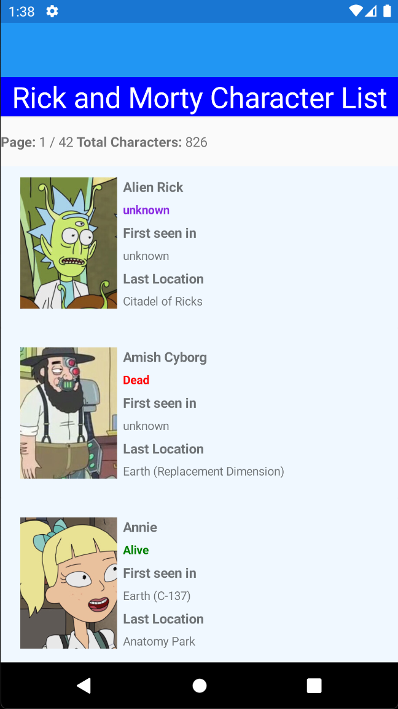
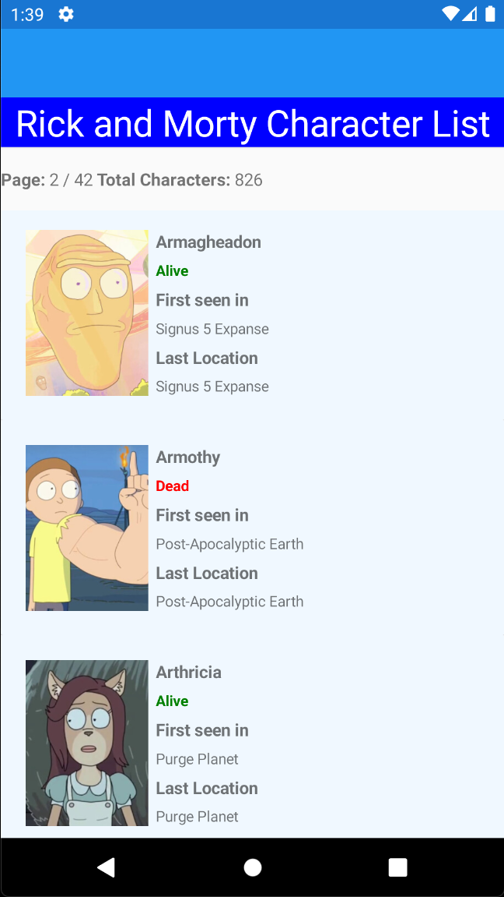
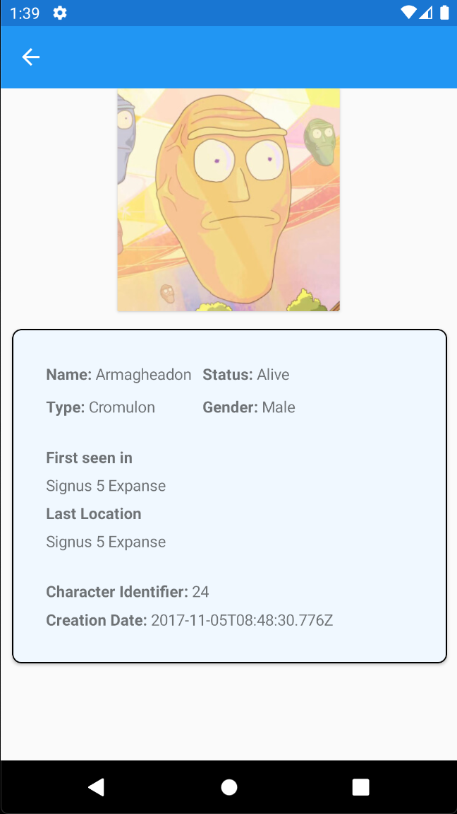
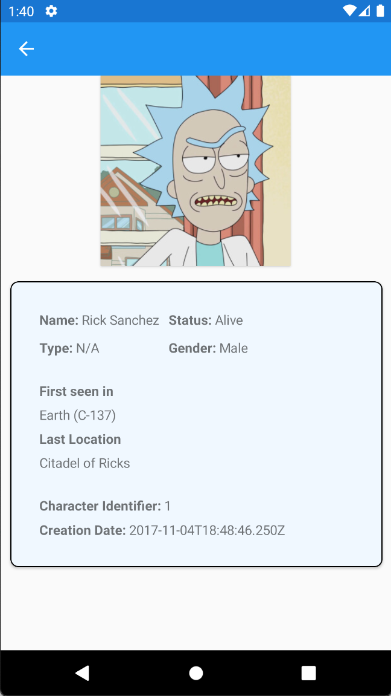

# RickAndMorty
Ricky and Morthy characters mobile app with Xamarin Forms

Task
1. On the MainPage display the image of each character and it's missing information.
2. Create a StringToColorConverter that styles the status of each character. 
   1. Unknown = Purple, Dead = Read, Alive = Green, Default = Grey
3. Add the missing data to the CharacterInfo page.

 

